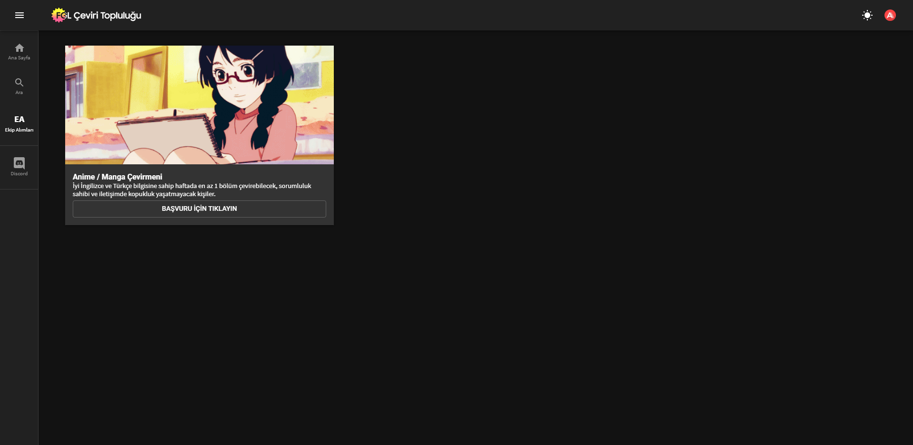
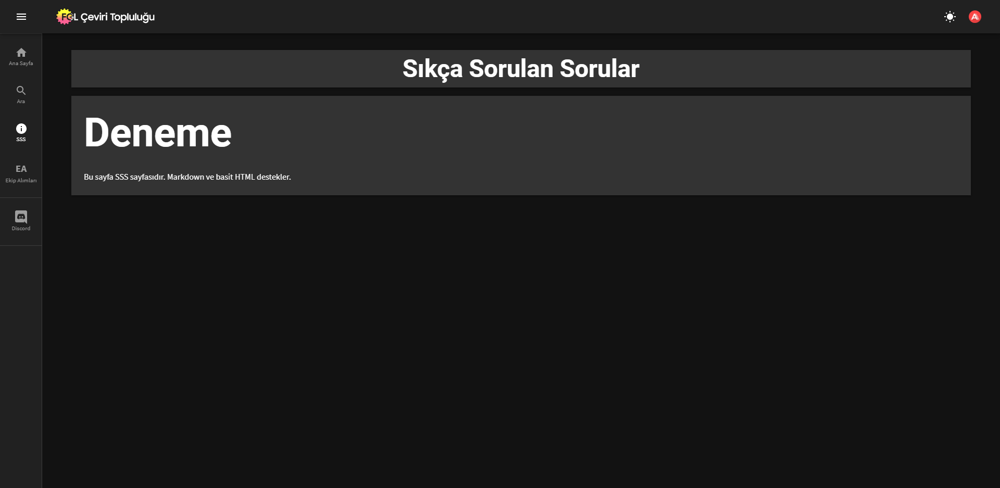

# Front-end'in config Klasöründe Bulunan Dosyaları Düzenleme

Bu sayfada öğrenebileceklerinizle sidebar'ınızdaki linkleri, ekip alımları ve sıkça sorulan sorular sayfalarını düzenleyebilirsiniz.

## Sidebar'a Link Ekleme

`./src/config/drawer_items.js` yolunda bulacağınız dosyaya düzenleme yaparak sidebar'a link ekleyebilirsiniz.

!!! danger "NOT"
    Özel sayfa eklediyseniz, burada herhangi bir düzenleme yapmanıza gerek yok! [Burada](yeni-sayfa-ekleme/) anlatılan yöntemle eklenen sayfaların linkleri, sistem linklerinin bulunduğu kısıma ekleniyor. Buraya ekleyeceğiniz linkler, sayfa dışına yönlendiren linkler olmalıdır.

Ekleyeceğiniz linkler


Destek Ol kısmının altındaki çizgiden sonra gösterilecektir. Paketi indirdiğinizde `./src/config/drawer_items.js` dosyasında örnek bir Discord linki zaten eklenmiş olacaktır. Bu örneği isterseniz silebilir, isterseniz de düzenleyerek kullanabilirsiniz.

`./src/config/drawer_items.js` dosyası Array çıkarır. Array'e eklemeniz gereken Objectler şöyle olmalıdır.

!!! note "Object"
    ```js
    {
        icon: "",           // String: Yazı solundaki ikon.
        title: "",          // String: Drawer açıkken gözükecek text.
        short_title: "",    // String: Drawer kapalıyken ikon altında gözükecek text.
        link: ""            // String: Sekmenin yönlendireceği yol.
    }
    ```

`icon` kısmında Material UI ikonları ya da FontAwesome linki kullanabilirsiniz. Sayfa ekleme kısmında Material UI örneği vermiştik, burada FontAwesome örneği veriyoruz.

!!! note "`drawer_items.js` Örnek"
    ```jsx
    import React from 'react'
    import { FontAwesomeIcon } from '@fortawesome/react-fontawesome'
    import { faDiscord } from '@fortawesome/free-brands-svg-icons'

    export default [
        {
            icon: <FontAwesomeIcon icon={faDiscord} size="2x" />,
            title: "Discord sunucumuza katılın!",
            short_title: "Discord",
            link: "https://discord.gg/davetkodu"
        }
    ]
    ```

## Footer'a Link Ekleme

`./src/config/footer_items.js` yolunda bulacağınız dosyaya düzenleme yaparak sidebar'a link ekleyebilirsiniz.

!!! danger "NOT"
    Özel sayfa eklediyseniz, burada herhangi bir düzenleme yapmanıza gerek yok! [Burada](yeni-sayfa-ekleme/) anlatılan yöntemle eklenen sayfaların linkleri, sistem sekmelerine ekleniyor. Buraya ekleyeceğiniz linkler, sayfa dışına yönlendirmelidir.

Ekleyeceğiniz linkler


menü butonlarının altında, ForFansubs yazısının üstünde gösterilecektir.

`./src/config/footer_items.js` dosyası Array çıkarır. Array'e eklemeniz gereken Objectler şöyle olmalıdır.

!!! note "Object"
    ```js
    {
        title: ""   // String: Gösterilecek text 
        link: ""    // String: Sekmenin yönlendireceği yol.
    }
    ```

!!! note "`footer_items.js` Örnek"
    ```js
    module.exports = [
        {
            title: "Github",
            link: "https://github.com"
        }
    ]
    ```

## Ekip Alımları Sayfasına Panel Ekleme

`./src/config/recruitment_panels.js` yolunda bulacağınız dosyaya düzenleme yaparak ekip alımları sayfasına panel ekleyebilirsiniz.

!!! danger "NOT"
    Bu sayfaya en az bir panel eklemeniz önerilir, çünkü Ekip Alımları menüsü sayfada herhangi bir panel olmasa da gösterilecektir.

Ekleyeceğiniz paneller



sayfa içerisinde bu şekilde gösterilecektir.

`./src/config/recruitment_panels.js` dosyası Array çıkarır. Array'e eklemeniz gereken Objectler şöyle olmalıdır.

!!! note "Object"
    ```js
    {
        title: "",           // String: Resmin altında, açıklamanın üstünde gözükecek yazı.
        subtitle: "",        // String: Resmin ve title'ın altında gözükecek, açıklama yazısı.
        image: "",           // String: Resim linki.
        link: "",            // String: Kullanıcının butona tıkladığında yönlendirileceği link.
        button_text: "",     // String: is_active 1'se buton gösterilir. Bu butonun içerisindeki yazı.
        is_active: 1         // Number: 0 yaparak butonu deaktif hale getirebilirsiniz.
    }
    ```

`is_active` değerini 0 yaptığınız zaman buton deaktif olup içerisinde "Alımlar kapalı" yazacaktır.

!!! note "`footer_items.js` Örnek"
    ```js
    module.exports = [
        {
            title: "Anime / Manga Çevirmeni",
            subtitle: "İyi İngilizce ve Türkçe bilgisine sahip kişiler.",
            image: "https://i.imgur.com/JEzNeYQ.png",
            link: "https://fgl.moe",
            button_text: "Başvuru için tıklayın"
        }
    ]
    ```

## SSS Sayfası Oluşturma

`./src/config/sss_page_text.js` yolunda bulacağınız dosyaya düzenleme yaparak sidebar'a link ekleyebilirsiniz.

!!! note "Not"
    Aslında özel sayfa ekleme özelliği geldikten sonra bu sayfanın pakette dahil bir sayfa olmasının anlamı kalmadı. Ama bu özelliğe güzel bir örnek olarak kullanılabileceği için kaldırmıyorum.

!!! danger "Unutmayın!"
    Bu sayfayı aktif etmek istiyorsanız `.env` dosyanızda `REACT_APP_SSS_PAGE` değerini `true` yapmanız gerekiyor.

Sayfaya ekleyeceğiniz Markdown formatlı text



bu formatta gösterilecektir.

`./src/config/sss_page_text.js` dosyası String çıkarır.

!!! note "`sss_page_text.js` Örnek"
    ```js
    export default String.raw`
    # Deneme

    Bu sayfa SSS sayfasıdır. Markdown ve basit HTML destekler.
    `
    ```

!!! danger "NOT"
    Yukardaki örnekte String.raw içerisine eklenen texte lütfen dikkat edin. Sola dayalı bir şekilde eklemeniz gerekiyor. Eğer satır başlarında boşluk kalırsa Markdown algılanmıyor!
