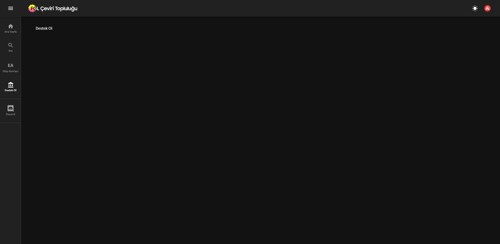

# Front-end'e Yeni Sayfa Ekleme

Versiyon kontrolü yüzünden normal dosya düzeninde herhangi bir yerde yeni bir dosya oluşturduğunuz zaman, güncelleme sırasında bu dosyalar otomatik silinir. Ön tarafa yeni sayfalar eklemenizi sağlayabilmek için `front-end` paketinde, `./src/pages/extra-pages/` klasörü oluşturuldu. Bu klasör içerisindeki `index.js` dosyasını aşağıda anlatıldığı gibi düzenleyip, gerekli dosyaları ve klasörleri `./src/pages/extra-pages/pages` klasörü altında oluşturursanız, sayfalarınızı istediğiniz gibi oluşturabilir ve düzenleyebilirsiniz. Ayrıca her güncelleme geldiğinde sayfalarınız olduğu gibi kalır.

!!! danger "DİKKAT"
    Her gelen güncellemede herhangi bir pakette düzenleme yapılıp yapılmadığını kontrol etmek sizin sorumluluğunuzdadır. Zaman içerisinde bazı paketler kaldırılabilir, bazı paketler büyük güncellemeler alıp, kod üzerinde düzenleme isteyebilir. (Ek paket güncellemeleri/kaldırılmalarını ilgili paketin github üzerindeki `releases` sayfasında belirtiyorum.) Ayrıca bu yöntemle, oluşturacağınız sayfalarda sadece paket içerisinde hazır bulunan ek paketleri kullanabilirsiniz. Kendiniz özel bir paket eklemeye çalıştığınız zaman, gelen ilk güncellemede bu paket kaldıralacak ve eklenen bu özelliğin herhangi bir önemi kalmayacaktır. `front-end` paketi üzerinde tam kontrol istiyorsanız, her şeyden kendiniz sorumlusunuz. 

Yeni sayfalar oluşturmak için `./src/pages/extra-pages` klasörünü kullanacağız. `./index.js` yolundaki dosyaya, `./src/pages/extra-pages/pages` yolunda açacağınız dosyaları tanımlayacaksınız. Bu dosya, ek sayfa bilgilerini tutacak ve gerekli yerlere export edecek. Array çıkarır. Array içerisine gelecek Object'lerin düzeni aşağıdaki gibidir.

!!! note "Object"
    ```js
    {
        PageTitle: "", // String: Sidebar açık olduğu zaman ikon yanında gözükecek text
        PageShortTitle: "", // String: Sidebar kapalı olduğu zaman ikon altında gözükecek text
        PageComponent: Object, // Object: React objesi
        PageIcon: React.Component, // React.Component: Material UI Icon vb.  
        PageUrl: "" // String: Sayfanın bulunacağı link
    }
    ```

!!! note "`index.js` Örnek"
    ```js
    import React from 'react'

    import { AccountBalance } from "@material-ui/icons";

    const pages = [
        {
            PageTitle: "Destek Ol",
            PageShortTitle: "Destek Ol",
            PageComponent: require('./pages/destek-ol/index').default,
            PageIcon: <AccountBalance />,
            PageUrl: "/destek-ol"
        }
    ]

    export default pages
    ```

Bu objeyi oluştururken dikkat etmeniz gereken önemli iki kısım var. Birincisi `PageComponent` değeri. Bu değer içerisinde React objesi tutuyor, buradan alınan değerle kullanıcının göreceği sayfa oluşturuluyor. `require('./pages/sayfa-ismi/index')` kısmında dosyayı alıyoruz, `.default` kısmında da dosya içerisindeki default export'a erişiyoruz.

!!! note "Not"
    `index.js`'e React'ı import etmeyi unutmayın. Yoksa hata alırsınız.

İkincisi de `PageIcon` değeri. Bu değere `@material-ui/icons` paketindeki ikonlardan birisini verebilirsiniz, ki yukardaki örnekte de böyle bir ikon var. (Kullanabileceğiniz Material UI ikonlarına [buradan](https://material-ui.com/components/material-icons/) ulaşabilirsiniz.) Ayrıca, herhangi bir ikon paketi kullanmak zorunda değilsiniz. `PageIcon` değerini `<h2>DO</h2>` yaparak istediğiniz 2 karakterli ikonu oluşturabilirsiniz. (h2 tagını kullanmanız gerekiyor, çünkü ana sayfada normal text kullanılan ikonların hepsi h2 tagını kullanıyor.)

`./pages/sayfa-ismi/index` dosyasının aşağıdaki format üzerinden oluşturulması gerekiyor.

!!! note "Sayfa şablonu"
    ```jsx
    import React from 'react'

    export default function SayfaIsmi() {
        return (
            <>
            </>
        )
    }
    ```

!!! note "`./pages/destek-ol/index.js` Örnek"
    ```jsx
    import React from 'react'
    import { Typography } from '@material-ui/core'

    export default function DestekOl() {
        return (
            <>
                <Typography>
                    Destek Ol
                </Typography>
            </>
        )
    }
    ```

!!! note "Not"
    Bu sayfa içerisinde `package.json`'da listesini bulabileceğiniz paketleri kullanabilirsiniz.

Yukardaki örneği kullandığınızda



böyle bir sonuça ulaşırsınız.

### Dosya düzeni

```
pages
    ara
    ceviriler
    ekip-alimlari
    episode
    extra-pages
        pages
            sayfa-adi1
                index.js
            sayfa-adi2
                index.js
            sayfa-adi3
                index.js
        index.js
    index
    kayit-tamamla
    manga-episode
    sss
```
